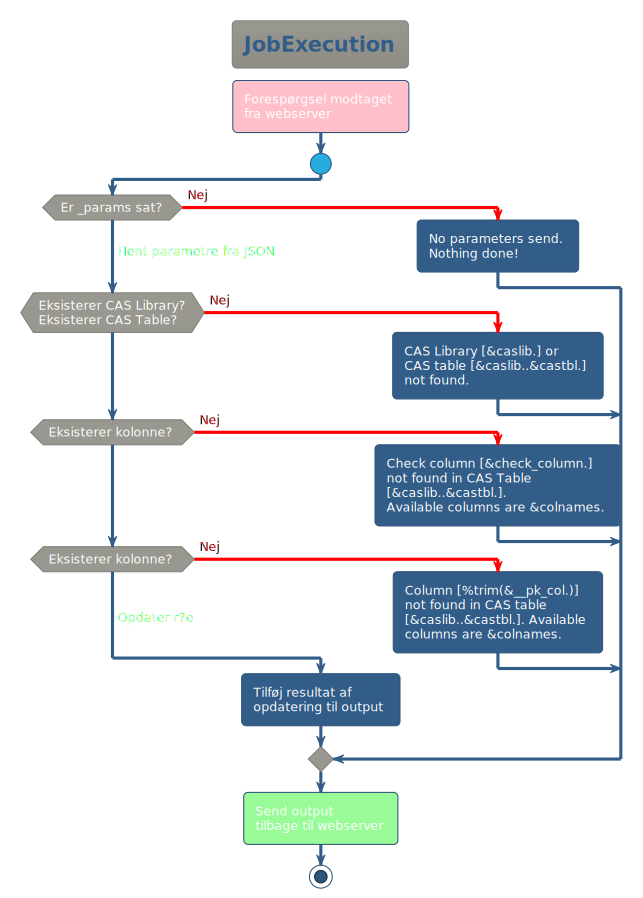

# Formål

Eksempel på feedback med Data Drive Content i SAS Visual Analytics med beskrivelse af, hvordan det kan anvendes i rapportering.

* [Anvendelse](#user-content-anvendelse)
* [Design](#user-content-design)
* [Kode](#user-content-kode)
  * [Rapporteksempel](#user-content-rapporteksempel)
  * [Data til eksempel](#user-content-data-til-eksempel)
  * [HTML og JavaScript](#user-content-html-og-javascript)
  * [Job Execution Server](#user-content-job-execution-server)
  * [Microsoft SQL Server](#user-content-microsoft-sql-server)
* [Forbedringspotentialer](#user-content-forbedringspotentialer)

# Anvendelse

Data leveres fra eksempelvis SAS 9.4 til CAS i SAS Viya. I forberedelsen af data skal der dannes et unikt id, som persisteres (fastholdes) for den pågældende række i datasættet. Id'et er forudsætning for, at status på rækken kan lagres.

Tabellen skal desuden være udstyret med kolonnen _checked, som anvendes til at registrere brugerens feedback.

Data overføres til CAS, og rapport udarbejdes. I rapporten kan listetabel kombineres med Data Driven Content. Her anvendes følgende URL:

https://_{hostnavn}_/htmlcommons/test/feedback.html

Denne fil indeholder JavaScript, som håndterer interaktion med bruger og server-side script til lagring af data.

Data Driven Content tilføjes fra Objekter i panelet i venstre side af rapportbyggeren:


Når objektet er tilføjet, angives adressen på html-filen ovenfor under Indstillinger → Webindhold → URL-ADRESSE.

Angiv en brugerdefineret titel, fx "Klik for at opdatere".

I rapporten skal følgende to kategorikolonner defineres:

* __pk_id_[primærkolonnenavn] - her indsættes kolonnenavnet på den kolonne, som indeholder unikt og persisterende id for hver række i datasættet. Data skal angives som id.
* __tbl_[caslib].[castabel] - har angives CAS Library og CAS-tabel for den tabel, der anvendes i SAS VA og som indeholder  kolonnen _checked. Data i denne kolonne anvendes ikke - id kan evt. bruges endnu en gang.


I definitionen af de brugerdefinerede elementer angives id'et.


Det datadrevne objekt skal have tildelt Dataroller (panelet i højre side).


Her _skal_ de to definerede kategorier fremgå sammen med kolonnen _checked.

Der skal oprettes objektlink under Handlinger (panelet i højre side) fra det objekt, som skal sende data til det datadrevne objekt.


De to kolonner linkes (som minimum) fra listetabellen til Data Driven Content. Kolonnerne skal ikke nødvendigvis vises i listetabellen så længe, at de inkluderes som skjulte kolonner.

Når brugeren klikker på en række i listetabellen, sender SAS VA data til Data Driven Content. Her identificerer et JavaScript de to definerede kategorikolonner. Id-kolonnen anvendes til at danne checkboks. Herefter afventes brugerens input.

Hvis brugeren klikker i checkboksen, vil scriptet sende værdien af boksen til et SAS Job Execution Script, som opdaterer _checked-kolonnen i tabellen og lagrer data permanent i tabel på Microsoft SQL Server.

Listetabellen opdateres ikke automatisk. Hvis du har lavet filter, som skjuler data, når status ændres, vil det være nødvendigt at opdatere rapporten før, at rækken forsvinder. Det kan evt. løses ved at sætte rapporten til automatisk at opdatere data løbende.

CAS-tabellen skal desuden have de nødvendige rettigheder for, at brugeren kan skrive i _checked-kolonnen. Specifikt skal der tildeles direkte rettigheder til opdatering for den gruppe, som anvender feedback-funktionen. Alternativt kan rettigheden sættes på SU4004-SG-FISK_SAS_RISK_G. Bemærk, at med denne rettighed får brugerne adgang til at ændre i tabellen. Anvendelsen af løsningen skal derfor være indenfor en sikkerhedsvurdering af, at adgangen ikke giver risiko for kompromittering af forretningskritiske data. (Et potentiale kan være udvikling af en løsning, hvor registreringerne foretages i selvstændig tabel, som flettes med VA-rapporten for at give samme resultat. Det vil øge sikkerheden, da opdateringsadgangen kun gives til kolonner, hvor statusmarkeringen står i.)


# Design

Der anvendes i Feedback en række komponenter og teknologier (nummerering refererer til figur længere nede):

* SAS Visual Analytics (1.1)
  * Data Driven Content (1.2)
* HTML
  * CSS
  * JavaScript (1.3 / 2.1 / 2.5)
  * AJAX (Asynchronous JavaScript And XML)
SAS Job Execution Server (2.2)
  * SAS-kode (2.4
  * CAS Table Actions (2.3)
  * ODBC
* Microsoft SQL Server

For at data modtaget fra web kan skrives uden adgangsfejl, anvendes der i denne løsning Microsoft SQL Server. Med anvendelse af SAS-datasæt er der en potientiel risiko for fejl ved samtidige skrivninger ifm. brugerinteraktion.

Interaktionen mellem de forskellige komponenter er beskrevet i figuren nedenfor.

<!--
@startuml
!theme mars
<style>
skinparam titleBorderRoundCorner 15
skinparam titleBorderThickness 2
skinparam titleBorderColor red
skinparam titleBackgroundColor Aqua-CadetBlue
</style>
Actor User
group Feedback from SAS Visual Analytics
else Initialize Data Driven Content
== Initialize Data Driven Content ==
autonumber 1.1 "[##.0]"
!pragma teoz true
box "SAS Viya" #AquaMarine
box "SAS Visual Analytics" #LightBlue
participant Report
participant "Data Driven Content" as DDC
end box
participant "JobExecution" as JES
participant CAS
participant MSSQL
end box
User -> Report : Click on row
Report -> DDC : messageEvent
DDC -> User : GUI Checkbox
== Update status ==
autonumber 2.1 "[##.0]"
User -> DDC : Change Checkbox
DDC -> JES : Submit data
JES -> MSSQL : Persist Data
JES -> CAS : Update Data
JES -> DDC : Result
DDC -> User : GUI Status
end
@enduml
-->


Nedenfor er de forskellige komponenter tegnet op.

<!--
@startuml
!theme mars
allowmixing

<style>
Legend {
  BackgroundColor: none,
  LineThickness: 0px,
  FontColor: Gray
}
</style>

database "SAS Table" {

}

database "CAS Table" {
}

json "Nødvendige kolonner" as ReportTable {
   "{primary key}":"unik og persisterend",
   "_checked":"statuskolonne - char(1)"
}

"SAS Table" -right- ReportTable : ETL fra SAS 9.4

ReportTable -right-> "CAS Table" : Tilføj kolonner

package "SAS Visual Analytics" {
  component "VA Rapport"
  () "Data Driven Content"
  actor "Bruger"
  "Bruger" -> "VA Rapport"
  "VA Rapport" .[#red,thickness=2]right.> "Data Driven Content" : "Ved bruger-\ninteraktion"
}

"CAS Table" -down-> "VA Rapport" : Definer kategorier

set namespaceSeparator none
cloud "feedback.html" {
  node HTML {
  }
  () CSS
  () "JavaScript/AJAX" as JavaScript
	CSS -right-> HTML : Layout
	HTML <-down-> JavaScript : Interaktion
}


package "SAS Job Execution Server" {
  node "Feedback JES" {
  }
  legend
    SAS-kode med anvendelse af
    JSON libname og SAS CAS Table Action Sets.
  endlegend
}

"Data Driven Content" -down-> HTML : Data sendes med\nmessageEvent

JavaScript .[#red,thickness=2].> "Feedback JES" : "Ved ændring\nfra bruger"

"Feedback JES" -[#green,thickness=2]up-> "CAS Table" : "Opdatering\nhvis MSSQL er ok"

database "Microsoft SQL Server" {
json "SAS VA feedback persisterende" as SAS_VA_Feedback_PersistetStorage {
   "CAS Library":"Navn på CAS Library",
   "CAS Table":"Navn på CAS table",
   "CAS User":"Brugernavn",
   "Primary Key Name":"Navn på unik id",
   "Value":"0/1 som karakterværdi",
   "Timestamp": "Tidspunkt for registrering"
}
}

"Feedback JES" -[#green,thickness=2]right-> "SAS_VA_Feedback_PersistetStorage" : "Indsættes"

@enduml
-->


# Kode
## Rapporteksempel

Placering på SAS Viya: /SAS Indhold/Projects 

Navn: feedback_PoC (type: Report)

Web: https://_{hostnavn}_/links/resources/report?uri=/reports/reports/_{guid}_

Sti til SAS Visual Analytics: https://_{hostnavn}_/SASVisualAnalytics/

## Data til eksempel

I rapporten anvendes kopi af meldingsdata, som kan dannes med flg. kode, hvis den ikke er i CAS:

### Kode til dannelse af PoC-tabel
```
libname y cas caslib="Projekt";
proc casutil incaslib="Projekt" outcaslib="Projekt";
droptable casdata="Feedback_PoC_test";
quit;

data y.Feedback_PoC_test (promote=yes);
length _checked $1 ID_kolonne 8;
set sashelp.class;
_checked = "0";
ID_kolonne = _n_;
run;
```

Her er tilføjet en kolonne til at gemme brugerens indtastning.

## HTML og JavaScript

Sti: /opt/sas/viya/home/var/www/html/htmlcommons

Filnavn: feedback_PoC.html

Sti til fil på webserveren: https://_{hostnavn}_/htmlcommons/test/feedback_PoC.html

Denne fil er som udgangspunkt en HTML-fil. Den indeholder desuden opsætning med CSS samt JavaScript til at håndtere interaktionen med brugeren såvel som Job Execution Server.

Scriptet er baseret på funktionalitet i Data Driven Content (DDC) i SAS Visual Analytics. Her sendes data til DDC via JavaScript med en message event, som sendes, når brugeren klikker på en række i listetabellen. I scriptet defineres en event listener, som aktiverer en funktion, når data modtages. Funktionen danner nye HTML-elementer til siden, som viser inputboksen og evt. yderligere data, hvis disse er defineret på DDC'en.

Inputboksen dannes med en change event. Når brugeren klikker på inputboksen, aktiveres en funktion der sender data til SAS Job Execution Server. Data er formet som JSON og angives i URL'en, og forespørgslen sendes som en XHR request med en HTTP GET metode. Overordnet betegnes denne tilgang typisk som AJAX.

Resultatet af forespørgslen returneres ligeledes fra webserveren via HTTP. Her håndterer scriptet evt. fejl i kommunikationen og returnerer det i HTML-siden i statusområdet nederst. Såfremt der opstår fejl på serversiden i forbindelse med opdateringen af data, bliver dette håndteret i SAS-koden og returneret til scriptet med data formateret i JSON-format. Dette angives ligeledes i statusfeltet.

Der dannes desuden løbende beskeder i konsollen i browserens debugger. Debuggeren åbnes ved at trykke på F12. Herefter vælges fanebladet Console. Hvis der opstår fejl ved anvendelse af feedback-scriptet er det hensigtsmæssigt at orientere sig i, hvad der er skrevet i konsollen ligesom, at det kan være en hjælp at se på kommunikationen i fanebladet Network.

## Job Execution Server

Placering på SAS Viya: /SAS Indhold/Projects

Navn: feedback_PoC (type: Job definition)

Stil til Job Execution Server: https://fst-viya-exp01u.prod.sitad.dk/SASJobExecution

Her anvendes SAS-kode til at opdatere _checked-kolonnen i CAS-tabellen og returnere svar til SAS VA.

En række i et table i CAS kan opdateres med følgende kode, hvor der anvendes CAS Tables Action Set:

### Opdatering af række i CAS-tabel
```
cas casauto;
proc cas;
   session casauto;
   table.update /
     set={
     { var="_checked", value="1" }
     },
   table = {
     caslib = "EJER",
     name = "B339389_test",
     where = "XX_MELDINGS_ID eq 718284" }
;
quit;
```

Job Execution Server modtager brugerens input sendt fra browseren med JavaScript via webserveren. Herefter eksekverer den SAS-koden.

SAS-koden er wrappet med en makro for at kunne anvende [SAS %GOTO Macro Statement](https://documentation.sas.com/doc/en/pgmsascdc/9.4_3.5/mcrolref/p0jfeh75p72icen1ddd9una5zbmm.htm) til at lave fejlhåndtering. Koden tjekker for om parametre ser sendt, om CAS Library og CAS Table eksisterer, og om kolonnen defineret i parametrene findes. Hvis ikke defineres fejlbesked, og der sendes output i JSON-format tilbage til webserveren.

<!--
@startuml
!theme sandstone
!pragma useVerticalIf on
#pink:Forespørgsel modtaget\nfra webserver;
start
if (Er _params sat?) then (<color:red>Nej)
  -[#red]->
  :No parameters send.\nNothing done!;
(Hent parametre fra JSON) elseif (Eksisterer CAS Library?\nEksisterer CAS Table?) then (<color:red>Nej)
  -[#red]->
  :CAS Library [&caslib.] or\nCAS table [&caslib..&castbl.]\nnot found.;
elseif (Eksisterer kolonne?) then (<color:red>Nej)
  -[#red]->
  :Check column [&check_column.]\nnot found in CAS Table\n[&caslib..&castbl.].\nAvailable columns are &colnames.;
elseif (Eksisterer kolonne?) then (<color:red>Nej)
  -[#red]->
  :Column [%trim(&__pk_col.)]\nnot found in CAS table\n[&caslib..&castbl.]. Available\ncolumns are &colnames.;
else (Opdater række)
  :Tilføj resultat af\nopdatering til output;
endif
#palegreen:Send output\ntilbage til webserver;
stop
@enduml
-->


Hvis opdateringen foretages, samles statusbeskeder mv. og sendes ligeledes retur til webserveren i JSON-format. Webserveren returnerer så svaret til browseren, hvor JavaScriptet viser status for opdateringen.

## Microsoft SQL Server

Adgangen til data på SQL-serveren i SAS Data Integration Studio foregår via SAS Library "_{library navn}_" med libref _{libref}_. Biblioteket er opsat uden preassignment og skal derfor udenfor SAS Data Integration Studio allokeres med:

LIBNAME SQL_Viya SQLSVR  Datasrc=_{datasrc}_  SCHEMA=dbo authdomain='_{authdomain}_';

Forbindelsen til Microsoft SQL Server er på SAS 9.4 defineret i odbc.ini-fil, som ligger i filsystemet på Linux. Her er data source SQL_Viya_db defineret. Authentication domain SAS_Viya_db_auth er opsat i SAS Management Console, og bruge er opsat i brugergruppen SQLSERVER brugere med brugernavnene Viya_Feedback_exp01u hhv. Viya_Feedback_int01p for det respektive miljø. Brugerne har fuld adgang til tabellen på Microsoft SQL Server.

På Microsoft SQL Server lagres data fra feedback i tabellen [Viya_{servermiljø}_db].[dbo].[Feedback], hvor servermiljø er enten int01 for produktion eller exp01 for udvikling. Tabellen er defineret med følgende SQL-kode:

### Oprettelse< af tabel
```
USE [_{schema}_]
GO
CREATE TABLE
    [dbo].[Feedback]
(
    [ID] INT not null IDENTITY PRIMARY KEY,
    [Username] CHAR(8) not null,
    [CASLibrary] CHAR(8) not null,
    [CASTable] VARCHAR(32) not null,
    [PrimaryKey] VARCHAR(32) not null,
    [Status] BIT not null,
    [feedback_dttm] DATETIME2(3) not null,
    [insert_dttm] DATETIME not null default CURRENT_TIMESTAMP
)
;
GO
CREATE INDEX
    [id_org_row]
ON
    [dbo].[Feedback]
(
    [CASLibrary],
    [CASTable],
    [PrimaryKey]
)
GO
```

Der er defineret et indeks, som optimerer forespørgselstiden i forhold til data, der skal hentes til SAS 9.4.

Eksempel på indsætning af data kan se således ud:

### Indsætning af data
```
USE [_{schema}_]
GO
INSERT INTO
    [dbo].[Feedback]
(
    [Username],
    [CASLibrary],
    [CASTable],
    [PrimaryKey],
    [Status],
    [feedback_dttm]
) VALUES (
    'B339389',
    'MyCASLib',
    'MyCASTable',
    '1234',
    1,
    '2004-05-23T14:25:10.487'
)
GO
```

På SAS Viya er data source ligeledes defineret i /etc/odbc.ini og hedder også her SQL_Viya_db. Authentication domain er defineret i SAS Management Console på SAS Viya sammen med brugeren. Førstnævnte SQL_Viya_db_auth, mens brugerne her hedder hhv. Viya_Feedback_Insert_exp01u og Viya_Feedback_Insert_int01p. Disse brugere har kun rettigheder til at indsætte data i tabellen på Microsoft SQL Server.

Med SAS-kode, kan det se således ud:

### SAS - Indsætning af data med SQL Pass-Through
```
OPTIONS SET=EASYSOFT_UNICODE=YES;

libname test odbc
	dsn="_{dsn}_"
	schema="dbo"
	authdomain="_{authdomain}_"
;

%macro q(str);
%quote(%')&str.%quote(%')
%mend q;

%let sqldt = %sysfunc(datetime(), e8601dt25.3);

proc sql;
CONNECT USING test;
EXECUTE (
INSERT INTO
    [dbo].[Feedback]
(
     [Username],
     [CASLibrary],
     [CASTable],
     [PrimaryKey],
     [Status],
     [feedback_dttm]
) VALUES (
     %q(&sysuserid.),
     'MyCASLib',
     'MyCASTable',
     '1234',
     1,
     %q(&sqldt.)
)) BY test;
DISCONNECT FROM test;
quit;
```

### SAS Indsætning af data med SAS SQL
```
OPTIONS SET=EASYSOFT_UNICODE=YES;

libname test odbc
	dsn="_{dsn}_"
	schema="dbo"
	authdomain="_{authdomain}_"
;

proc sql;
INSERT INTO
  &nbsp; test.Feedback
(
     Username,
     CASLibrary,
     CASTable,
     PrimaryKey,
     Status,
     feedback_dttm
) VALUES (
     %quote(')&sysuserid.%quote('),
     'MyCASLib',
     'MyCASTable',
     '1234',
     1,
     datetime()
);
quit;
```

# Forbedringspotentialer
Parametre kontrolleres i JavaScript i feedback.html. Det kan dog være hensigtsmæssigt at indsætte samme validering i SAS-koden i Feedback på Job Execution Server. Den aktuelle implementering har som nu ikke fuld fejlhåndtering jf. unit testing.

Der kan være et potentiale i at parametrisere tabelkolonnen _checked via kategorier i SAS Visual Analytics på samme måde som anvendes til at angive kolonnenavnet på primærnøglen.

Med anvendelse af Job Execution Server får brugeren samtidig adgang til SAS StudioV. Teknisk set er det derfor muligt for brugeren at anvende de adgange, som er nødvendige for at afvikle scriptet, til at tilgå de samme ressourcer. Aktuel implementering åbner adgang for brugerne til at manipulere data i hele CAS-tabellen. Det kan ikke kompromittere data på SAS 9.4 og vil i det hypotetiske tilfælde, at det sker, blive overskrevet ved næste opdatering af data. Det vil dog temporært kunne ændre visningen af data. Det kræver ud over onde intentioner indsigt i SAS Viya at kunne foretage disse ændringer, som desuden vil være logget under den pågældende bruger. En anden tilgang kunne være at etablere registreringen af status i en parallel CAS-tabel, som så flettes på data direkte i listevisningen i SAS Visual Analytics. Det vil implementeringsmæssigt for den enkelte rapportbygger være væsentligt noget mere komplekst at sætte op for den enkelte rapport. Der vil desuden skulle laves ændringer af SAS-koden på Job Execution Server. Herved kan adgangen til data begrænses til tabellem med statuskolonnen. Metoden er ikke afprøvet i praksis.

Aktuel opsætning af forbindelse til Microsoft SQL Server er baseret på fast bruger. Et stærkere princip ville være, at brugerens credentials anvendes op mod SQL-serveren, da integriteten i logning her kan opretholdes med specifikation af den enkelte brugers handling på databasen.

_Den aktuelle anvendelse i hosstående eksempel indeholder ikke registrering af kritiske forretningsbeslutninger eller personhenførbare data. De ovenfor behandlede sikkerhedsbetragtninger ses derfor ikke som problematiske for implementeringen. Der skal dog tages forbehold for anvendelse med andre typer af informationer, hvor der igen må tages stilling til, om denne løsningsmodel anses for forsvarlig._

Opsætning af forbindelse fra SAS Viya til Microsoft SQL Server kan gøres med SAS/Access to Impala, hvorved adgangen er defineret fast. Se mere under [SAS Help Center: Configure Data Access|https://go.documentation.sas.com/doc/en/calcdc/3.5/dplyml0phy0lax/p03m8khzllmphsn17iubdbx6fjpq.htm#n123vsq7n1hh3vn1a17lsdpa90pq].

Ved opgradering til SAS Viya 4 vil der være adgang til libname option DM_UNICODE=, hvor UTF-8 kan sættes direkte på libname statement i stedet for generelt med option SET=EASYSOFT_UNICODE=YES. Se mere under SAS Help Center: [DM_UNICODE=|https://go.documentation.sas.com/doc/en/pgmsascdc/v_048/acreldb/p0ykl8zhh1w4wcn1e3gdip1lw8qz.htm].
