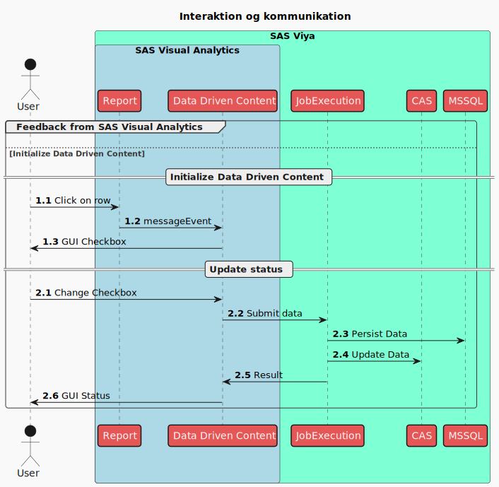

# Formål

Eksempel på feedback med Data Drive Content i SAS Visual Analytics med beskrivelse af, hvordan det kan anvendes i rapportering.

* [Anvendelse](#user-content-anvendelse)
* [Design](#user-content-design)
* [Kode](#user-content-kode)
  * [Rapporteksempel](#user-content-rapporteksempel)
  * [Data til eksempel](#user-content-data-til-eksempel)
  * [HTML og JavaScript](#user-content-html-og-javascript)
  * [Job Execution Server](#user-content-job-execution-server)
  * [Microsoft SQL Server](#user-content-microsoft-sql-server)
* [Forbedringspotentialer](#user-content-forbedringspotentialer)

# Anvendelse

Data leveres fra eksempelvis SAS 9.4 til CAS i SAS Viya. I forberedelsen af data skal der dannes et unikt id, som persisteres (fastholdes) for den pågældende række i datasættet. Id'et er forudsætning for, at status på rækken kan lagres.

Tabellen skal desuden være udstyret med kolonnen _checked, som anvendes til at registrere brugerens feedback.

Data overføres til CAS, og rapport udarbejdes. I rapporten kan listetabel kombineres med Data Driven Content. Her anvendes følgende URL:

https://_{hostnavn}_/htmlcommons/test/feedback.html

Denne fil indeholder JavaScript, som håndterer interaktion med bruger og server-side script til lagring af data.

Data Driven Content tilføjes fra Objekter i panelet i venstre side af rapportbyggeren:


Når objektet er tilføjet, angives adressen på html-filen ovenfor under Indstillinger → Webindhold → URL-ADRESSE.

Angiv en brugerdefineret titel, fx "Klik for at opdatere".

I rapporten skal følgende to kategorikolonner defineres:

* __pk_id_[primærkolonnenavn] - her indsættes kolonnenavnet på den kolonne, som indeholder unikt og persisterende id for hver række i datasættet. Data skal angives som id.
* __tbl_[caslib].[castabel] - har angives CAS Library og CAS-tabel for den tabel, der anvendes i SAS VA og som indeholder  kolonnen _checked. Data i denne kolonne anvendes ikke - id kan evt. bruges endnu en gang.


I definitionen af de brugerdefinerede elementer angives id'et.


Det datadrevne objekt skal have tildelt Dataroller (panelet i højre side).


Her _skal_ de to definerede kategorier fremgå sammen med kolonnen _checked.

Der skal oprettes objektlink under Handlinger (panelet i højre side) fra det objekt, som skal sende data til det datadrevne objekt.


De to kolonner linkes (som minimum) fra listetabellen til Data Driven Content. Kolonnerne skal ikke nødvendigvis vises i listetabellen så længe, at de inkluderes som skjulte kolonner.

Når brugeren klikker på en række i listetabellen, sender SAS VA data til Data Driven Content. Her identificerer et JavaScript de to definerede kategorikolonner. Id-kolonnen anvendes til at danne checkboks. Herefter afventes brugerens input.

Hvis brugeren klikker i checkboksen, vil scriptet sende værdien af boksen til et SAS Job Execution Script, som opdaterer _checked-kolonnen i tabellen og lagrer data permanent i tabel på Microsoft SQL Server.

Listetabellen opdateres ikke automatisk. Hvis du har lavet filter, som skjuler data, når status ændres, vil det være nødvendigt at opdatere rapporten før, at rækken forsvinder. Det kan evt. løses ved at sætte rapporten til automatisk at opdatere data løbende.

CAS-tabellen skal desuden have de nødvendige rettigheder for, at brugeren kan skrive i _checked-kolonnen. Specifikt skal der tildeles direkte rettigheder til opdatering for den gruppe, som anvender feedback-funktionen. Alternativt kan rettigheden sættes på SU4004-SG-FISK_SAS_RISK_G. Bemærk, at med denne rettighed får brugerne adgang til at ændre i tabellen. Anvendelsen af løsningen skal derfor være indenfor en sikkerhedsvurdering af, at adgangen ikke giver risiko for kompromittering af forretningskritiske data. (Et potentiale kan være udvikling af en løsning, hvor registreringerne foretages i selvstændig tabel, som flettes med VA-rapporten for at give samme resultat. Det vil øge sikkerheden, da opdateringsadgangen kun gives til kolonner, hvor statusmarkeringen står i.)


# Design

Der anvendes i Feedback en række komponenter og teknologier (nummerering refererer til figur længere nede):

* SAS Visual Analytics (1.1)
  * Data Driven Content (1.2)
* HTML
  * CSS
  * JavaScript (1.3 / 2.1 / 2.5)
  * AJAX (Asynchronous JavaScript And XML)
SAS Job Execution Server (2.2)
  * SAS-kode (2.4
  * CAS Table Actions (2.3)
  * ODBC
* Microsoft SQL Server

For at data modtaget fra web kan skrives uden adgangsfejl, anvendes der i denne løsning Microsoft SQL Server. Med anvendelse af SAS-datasæt er der en potientiel risiko for fejl ved samtidige skrivninger ifm. brugerinteraktion.

Interaktionen mellem de forskellige komponenter er beskrevet i figuren nedenfor.

<!--
@startuml
!theme mars
<style>
skinparam titleBorderRoundCorner 15
skinparam titleBorderThickness 2
skinparam titleBorderColor red
skinparam titleBackgroundColor Aqua-CadetBlue
</style>
Actor User
group Feedback from SAS Visual Analytics
else Initialize Data Driven Content
== Initialize Data Driven Content ==
autonumber 1.1 "[##.0]"
!pragma teoz true
box "SAS Viya" #AquaMarine
box "SAS Visual Analytics" #LightBlue
participant Report
participant "Data Driven Content" as DDC
end box
participant "JobExecution" as JES
participant CAS
participant MSSQL
end box
User -> Report : Click on row
Report -> DDC : messageEvent
DDC -> User : GUI Checkbox
== Update status ==
autonumber 2.1 "[##.0]"
User -> DDC : Change Checkbox
DDC -> JES : Submit data
JES -> MSSQL : Persist Data
JES -> CAS : Update Data
JES -> DDC : Result
DDC -> User : GUI Status
end
@enduml
-->


Nedenfor er de forskellige komponenter tegnet op.

<!--
@startuml
!theme mars
allowmixing

<style>
Legend {
  BackgroundColor: none,
  LineThickness: 0px,
  FontColor: Gray
}
</style>

database "SAS Table" {

}

database "CAS Table" {
}

json "Nødvendige kolonner" as ReportTable {
   "{primary key}":"unik og persisterend",
   "_checked":"statuskolonne - char(1)"
}

"SAS Table" -right- ReportTable : ETL fra SAS 9.4

ReportTable -right-> "CAS Table" : Tilføj kolonner

package "SAS Visual Analytics" {
  component "VA Rapport"
  () "Data Driven Content"
  actor "Bruger"
  "Bruger" -> "VA Rapport"
  "VA Rapport" .[#red,thickness=2]right.> "Data Driven Content" : "Ved bruger-\ninteraktion"
}

"CAS Table" -down-> "VA Rapport" : Definer kategorier

set namespaceSeparator none
cloud "feedback.html" {
  node HTML {
  }
  () CSS
  () "JavaScript/AJAX" as JavaScript
	CSS -right-> HTML : Layout
	HTML <-down-> JavaScript : Interaktion
}


package "SAS Job Execution Server" {
  node "Feedback JES" {
  }
  legend
    SAS-kode med anvendelse af
    JSON libname og SAS CAS Table Action Sets.
  endlegend
}

"Data Driven Content" -down-> HTML : Data sendes med\nmessageEvent

JavaScript .[#red,thickness=2].> "Feedback JES" : "Ved ændring\nfra bruger"

"Feedback JES" -[#green,thickness=2]up-> "CAS Table" : "Opdatering\nhvis MSSQL er ok"

database "Microsoft SQL Server" {
json "SAS VA feedback persisterende" as SAS_VA_Feedback_PersistetStorage {
   "CAS Library":"Navn på CAS Library",
   "CAS Table":"Navn på CAS table",
   "CAS User":"Brugernavn",
   "Primary Key Name":"Navn på unik id",
   "Value":"0/1 som karakterværdi",
   "Timestamp": "Tidspunkt for registrering"
}
}

"Feedback JES" -[#green,thickness=2]right-> "SAS_VA_Feedback_PersistetStorage" : "Indsættes"

@enduml
-->


# Kode
## Rapporteksempel

Placering på SAS Viya: /SAS Indhold/Projects 

Navn: feedback_PoC (type: Report)

Web: https://_{hostnavn}_/links/resources/report?uri=/reports/reports/_{guid}_

Sti til SAS Visual Analytics: https://_{hostnavn}_/SASVisualAnalytics/

## Data til eksempel

I rapporten anvendes kopi af meldingsdata, som kan dannes med flg. kode, hvis den ikke er i CAS:

```
libname y cas caslib="Projekt";
proc casutil incaslib="Projekt" outcaslib="Projekt";
droptable casdata="Feedback_PoC_test";
quit;

data y.Feedback_PoC_test (promote=yes);
length _checked $1 ID_kolonne 8;
set sashelp.class;
_checked = "0";
ID_kolonne = _n_;
run;
```

## HTML og JavaScript
## Job Execution Server
## Microsoft SQL Server
# Forbedringspotentialer
